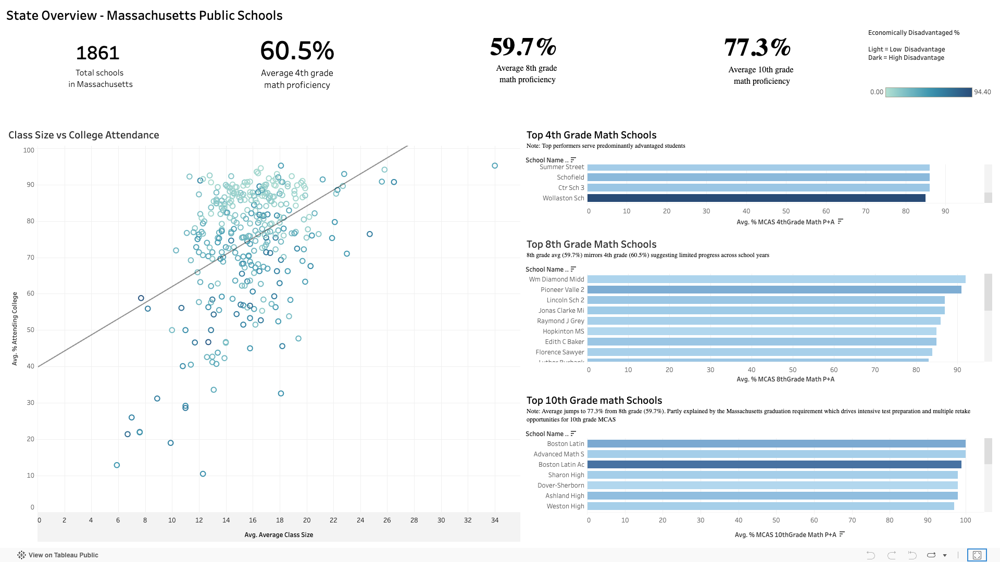
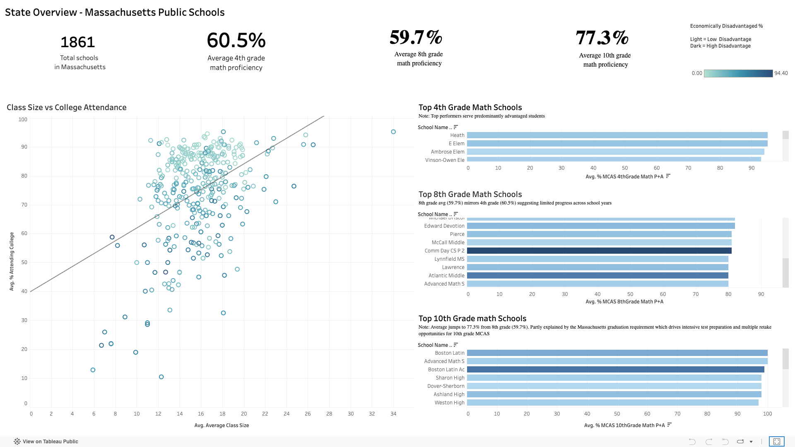

# Chalkboards and Dashboards
### AI-Augmented Analysis of Massachusetts Public Schools

A data analytics portfolio project combining Python, the OpenAI API and Tableau to generate deeper insights from the Massachusetts Department of Education dataset.

---

## Live Dashboards

View the interactive dashboards on Tableau Public:

**Chalkboards and Dashboards - MA Schools Analysis**

[**Dashboard 1: AI Insights Dashboard**](https://public.tableau.com/views/ChalkboardsandDashboards-MASchoolsAnalysis/Dashboard1?:language=en-US&:sid=&:redirect=auth&:display_count=n&:origin=viz_share_link)
A state map of all 678 AI classified schools and bar charts showing struggling schools ranked by school type (High School / Middle School / K8 School).

[**Dashboard 2: State Overview Dashboard**](https://public.tableau.com/views/ChalkboardsandDashboards-MASchoolsAnalysis/Dashboard2?:language=en-US&:sid=&:redirect=auth&:display_count=n&:origin=viz_share_link)
A scatter plot exploring class size and college attendance, plus top math schools ranked by grade level( Grade 4, Grade 8, Grade 10).




---

## The Most Surprising Finding

**18 Massachusetts public schools are simultaneously failing on student outcomes and failing on equity. These schools are the need for most urgent intervention.**

My AI classification rated these 18 schools as At Risk based on graduation rates, college attendance, SAT scores and AP performance etc. The Massachusetts state accountability system independently rated them Level 3 or Level 4, meaning they are also failing to close achievement gaps between student groups. Two completely different measurement systems reached the same conclusion about the same 18 schools. Among them are Boston Day and Evening Academy in Roxbury (9.8% graduation rate, Level 3), Dorchester Academy in Dorchester (16.4% graduation rate, Level 4), William McKinley School in Boston (29.4% graduation rate, Level 3) and Madison Park High in Roxbury (59.1% graduation rate, Level 4). These schools span different towns across Massachusetts, confirming this is a statewide pattern not an isolated problem.

But the more nuanced finding sits on the other end of the spectrum. 46 high schools were classified as Thriving by my AI system. Schools like Boston Latin (98.1% graduation rate) and Andover High (95.7% graduation rate) have numbers that look exceptional. Yet the state rated all 46 of them Level 2, meaning they are not closing achievement gaps for their disadvantaged students. These schools 
are doing very well for their advantaged students. They are not lifting everyone equally.

Neither of these findings was visible until I built my own classification system and compared it to the state's official data. That comparison is what this project is really about.


---

## Why I Built This

The Massachusetts Department of Education publishes school performance data for 1,861 schools across 299 columns. 299 columns of data exist for each school, but very little of it has been turned into actionable insight. That is what I intend to do with this project.

This project set out to answer four questions that a Massachusetts school board might actually ask:

1. What is the overall state of the public school system?
2. How does class size affect college attendance?
3. Which schools are the top math performers in the state?
4. Which schools are struggling the most and need urgent attention?

Each question has a dedicated view in the Tableau dashboards. Questions 1 and 4 use the AI enriched dataset of 678 classified schools. Questions 2 and 3 use the full original dataset of 1,861 schools because those questions benefit from the complete picture.

The core question driving the AI work was different though. Can AI surface insights from this dataset that Tableau alone cannot show? The answer turned out to be yes. But only after rigorous validation 
of the AI output.

---

## What This Project Demonstrates

### Data Preparation
The original 1,861 school dataset needed to be split into three groups before any analysis could happen. Each group required its own logic based on the metrics available for that school type. High schools have graduation data. K-8 schools have early grade MCAS scores. Middle schools have upper grade MCAS scores. Treating them all the same would have produced meaningless results.

### Analytical Thinking
High schools, K-8 schools and middle schools are measured completely differently by the state. Building a separate classification framework for each one was a deliberate analytical decision. Each prompt was designed around the metrics that actually matter for that school type.

### Prompt Engineering
Getting 678 consistent, parseable JSON responses from a language model required careful prompt design. The prompt had to specify the output format, define the four tiers clearly and guide the model on which metrics to prioritize. A single school test was always run before the full batch to catch errors early.

### API Integration
The OpenAI API was called programmatically in Python across all 678 schools. Rate limit management, error handling and automatic JSON parsing were all built into the classification functions so the process could run end to end without manual intervention.

### Critical Thinking
I did not trust the AI output until I had validated it three different ways. Tier progression was checked against the actual data. Obvious misclassifications were searched for. The same five schools were classified twice to test consistency. The validation section of the notebook exists because AI confidence is not the same as AI accuracy.

### Comparative Analysis
Comparing my classification to both Excel IF rules and the state official system was how the most important finding in this project emerged. Neither comparison was planned from the start. Both revealed something the AI classification alone could not show.

### Insight Generation
The equity gap finding, 46 schools Thriving on outcomes but failing on equity, was not something I set out to find. It emerged from the comparison. That is what makes it credible. I did not design the 
analysis to produce a headline. The headline came from the data.

### Communication
The AI enriched data was designed from the start to fedd directly into Tableau. AI generated insights appear as tooltip on every school. The dashboard was built to answer 4 specific questions a school board would actually ask.

---

## About the Dataset
 
- **Source:** Massachusetts Department of Education via Kaggle
- **Original data:** profiles.doe.mass.edu/statereport/
- **Rows:** 1,861 schools across Massachusetts
- **Columns:** 299 columns. Each school has 299 data points covering enrollment, demographics, academic performance, resource allocation and state accountability ratings 
- **Scope:** Public schools only. Private schools in Massachusetts are not required to report data to the state DOE and are therefore not included.

### The State Accountability System
The dataset includes the Massachusetts state official school rating, which classifies every public school into one of five levels based on whether achievement gaps between student groups are closing over time.

| Level | Meaning | Count in Dataset |
|---|---|---|
| Level 1 | Meeting gap narrowing goals | 521 schools |
| Level 2 | Not meeting gap narrowing goals | 787 schools |
| Level 3 | Lowest performing 20% of subgroups | 261 schools |
| Level 4 | Underperforming | 31 schools |
| Level 5 | Chronically underperforming, state takeover | 4 schools |
| Insufficient data | Not enough data to rate | 232 schools |

This system measures equity, not absolute outcomes. A school can have a high graduation rate and still be rated Level 2 if it is not closing gaps between its strongest and weakest student groups. This distinction is central to the most surprising finding in this project.
 
---
 
## How I Filtered to 678 Schools
 
Different school types track completely different metrics. A single classification framework for all 1,861 schools would have been meaningless. You cannot ask an elementary school for its graduation rate.
 
Instead I built three separate frameworks, each using the metrics that actually apply to that school type.
 

| School Type | School Count | Metrics Used for AI Classification |
|---|---|---|
| High Schools | 343 | Graduation rate, college attendance, SAT scores, AP scores, demographics, state accountability rating (19 metrics) |
| K-8 Schools | 254 | MCAS 3rd and 4th grade math and english , demographics, class size, expenditure per pupil, state accountability rating (21 metrics) |
| Middle Schools | 81 | MCAS 6th, 7th and 8th grade math and english demographics, class size, expenditure per pupil, state accountability rating (25 metrics) |
| Total Classified | 678 | 36% of all Massachusetts schools |
| Excluded | 1,183 | Early childhood centers, schools with incomplete data, alternative schools |

 
Rather than filtering by grade labels (which had 75 unique combinations in the dataset), I filtered by the presence of outcome data.
 
For high schools, I filtered to schools that reported both a graduation rate and a college attendance rate. Only schools with graduating classes track these metrics. This captured 343 high schools including K-12 and 6-12 schools that a simple grade label filter would have missed. Once identified, the AI evaluated graduation rate, dropout rate, college attendance, SAT math and reading scores, AP performance, student demographics, class size, expenditure per pupil and state accountability ratings when making its classification. 19 columns in total.
 
For K-8 schools, I excluded anything already identified as a high school and then filtered to schools that reported 4th grade MCAS scores. Every school that teaches 4th grade has this data regardless of whether it starts at Pre-K, Kindergarten or Grade 1. This captured 254 elementary schools across a wide range of grade configurations. Once identified, the AI evaluated both 3rd and 4th grade MCAS scores for math and english alongside demographic and resource metrics when making its classification. 21 columns in total.
 
For middle schools, I excluded high schools and K-8 schools and then filtered to schools that reported 8th grade MCAS scores but not 4th grade scores. A school with 8th grade data but no 4th grade data is almost certainly a standalone middle school rather than a K-8 school. This captured 81 middle schools. Once identified, the AI evaluated 6th, 7th and 8th grade MCAS scores for math and english alongside demographic and resource metrics when making its classification. 25 columns in total.
 
This three step decision tree meant each school was routed to exactly one bucket based on what data it actually had, not what it called itself.

  
---
 
##  The Four Tiers of AI Classification 
 
All three school types use the same four tiers so the Tableau dashboard stays consistent across school levels.
 
| Tier | Meaning |
|---|---|
| **Thriving** | Strong outcomes across most metrics |
| **Performing** | Average outcomes, no major red flags |
| **Struggling** | Below average outcomes in multiple key areas |
| **At Risk** | Significantly below average, needs urgent intervention |
 
### High School Classification Results
```
Performing    157  (46%)
Thriving      120  (35%)
Struggling     39  (11%)
At Risk        25   (7%)
Error           2   (1%)
```
 
---
 
## Validating the AI Output
 
Before using any classifications in Tableau I ran three separate tests. Each check catches a different type of potential problem. The tier progression check catches systematic errors. The spot check catches individual errors. The consistency check catches reliability problems. Passing all three gave me high confidence in the output before using it in the Tableau dashboard.

### Tier Progression Check
I calculated the average graduation rate, college attendance, dropout rate, economic disadvantage and state accountability percentile for each AI classification tier. The results showed a perfect descending pattern.

Thriving schools averaged 96.5% graduation down to At Risk schools averaging 42.3%. Every single metric moved in exactly the right direction across all four tiers. This was the strongest validation 
result because it showed the classifications were statistically sound at a population level, not just for individual schools.

### Spot Check
I searched for obvious contradictions. Schools labeled Thriving with graduation rates below 80%. Schools labeled At Risk with graduation rates above 90%. These would represent clear misclassifications. Zero such schools were found. The spot check does not prove the classifications are perfect but it confirms there are no glaring errors that would undermine the credibility of the analysis.

### Consistency Check
I classified the same five randomly selected schools twice each, with a half second pause between the two calls. All five got identical results both times. The consistency rate was 100%, which confirmed the prompt is clear and specific enough that the model reaches the same conclusion when given the same data twice. A low consistency rate would have indicated the prompt was too ambiguous and the classifications could not be trusted.
 
---
 
## Key Findings
 
## Key Findings
 
### 1. The Most Urgent Schools
18 schools are simultaneously At Risk on my classification and Level 3 or 4 on the state equity metric. They are failing on every available measure. Among them are Boston Day and Evening Academy in Roxbury (9.8% graduation rate, Level 3), Dorchester Academy in Dorchester (16.4% graduation rate, Level 4), William McKinley School in Boston (29.4% graduation rate, Level 3) and Madison Park High in Roxbury (59.1% graduation rate, Level 4). These schools span different towns across Massachusetts, confirming this is a statewide pattern not an isolated problem. This finding only emerged by comparing two completely different classification systems.
 
### 2. The Outcomes vs Equity Gap
46 high schools are Thriving on graduation and college attendance but rated Level 2 on the state equity metric. They are serving their advantaged students well. They are not closing achievement gaps for disadvantaged groups. Strong overall numbers can hide deeply unequal outcomes within a school.
 
### 3. AI vs Excel IF Rules
My AI classification and a rule-based Excel IF formula agreed 67.3% of the time. In the cases where they disagreed, the AI consistently caught things Excel missed. Schools with acceptable graduation rates but low SAT scores, high dropout rates and poor AP performance passed the Excel threshold but were flagged by the AI. Excel can only handle two or three metrics cleanly. The AI evaluated nineteen or more simultaneously.
 
### 4. Math Performance Across Grade Levels
Average 4th grade math proficiency (60.5%) and 8th grade math proficiency (59.7%) are nearly identical. There is almost no improvement between elementary and middle school years across the state. The jump to 77.3% at 10th grade partly reflects the Massachusetts graduation requirement, which drives intensive test preparation and gives students multiple retake opportunities for the 10th grade MCAS.
 
### 5. Top Math Schools and Economic Advantage
None of the top 20 schools by 4th grade math proficiency have more than 35% economically disadvantaged students. The correlation between wealth and academic performance is stark and consistent across all three grade levels analyzed.
 
 
---
 
## Files in This Repository
 
| File | Description |
|---|---|
| `MA_Schools_AI_Analysis_v4.ipynb` | Main analysis notebook with all classification, validation and comparison code |
| `MA_HighSchools_AI_Enriched.csv` | 343 high schools with AI classification, AI insights and Excel IF comparison |
| `MA_K8Schools_AI_Enriched.csv` | 254 K-8 schools with AI classification and MCAS performance columns |
| `MA_MiddleSchools_AI_Enriched.csv` | 81 middle schools with AI classification and MCAS performance columns |
| `MA_AllSchools_AI_Enriched.csv` | All 678 schools combined with common columns for the Tableau state overview |
| `MA_Schools_data_set.xlsx` | Original dataset from the Massachusetts DOE |
| `Data-Dictionary-Massachusetts-schools.pdf` | Data dictionary for the Data Set |
 
---
 
## How to Run This Notebook

1. Clone this repository
2. Make sure `MA_Schools_data_set.xlsx` is in the same folder as the notebook. The notebook loads this file directly by name so the path must match.
3. Install dependencies: `pip install openai pandas openpyxl`
4. Get an OpenAI API key at platform.openai.com
5. Open `MA_Schools_AI_Analysis_v4.ipynb` in VS Code or Jupyter
6. Replace `your-openai-key-here` in the API setup cell with your actual key
7. Run all cells in order from top to bottom

The notebook will generate four enriched csv files in the same folder when it completes:

- `MA_HighSchools_AI_Enriched.csv`
- `MA_K8Schools_AI_Enriched.csv`
- `MA_MiddleSchools_AI_Enriched.csv`
- `MA_AllSchools_AI_Enriched.csv`

These files are already included in this repository if you want to explore the Tableau dashboards without running the notebook.

**Estimated cost:** Approximately $0.50 to $1.00 to classify all 678 schools using gpt-4o-mini.
 
 
---
 
## Why gpt-4o-mini?
 
It costs about 15 times less than gpt-4o. After running the full classification I validated the output with a consistency check and got 100% reliability across five schools classified twice. The cheaper model was more than capable for this task.
 
---
 
## Limitations
 
1. **Single year snapshot.** This analysis is based on 2017 data only. School performance, accountability levels and demographic compositions may have changed significantly since then.
 
2. **Coverage is 36%.** 1,183 schools were excluded because they lacked sufficient data for meaningful classification. This is not a complete picture of all Massachusetts schools.
 
3. **Column selection was judgment based.** The columns passed to the AI were selected based on domain knowledge and reasoning about what matters in education. No formal statistical feature selection was run to validate these choices.
 
4. **The AI is a black box.** I validated the output but cannot see exactly why the AI made each individual decision. That is why the validation section exists.
 
5. **Multi-level schools are classified into one bucket.** K-12 and 6-12 schools are classified purely on their high school metrics. Their elementary and middle school performance is not evaluated separately.
   
6. **K-8 schools classified on early grades only.** K-8 schools have MCAS data from grades 3 through 8 but the classification only used grades 3 and 4. The upper grade performance of K-8 schools is not evaluated even though the data exists.
   
7. **Private schools are excluded.** The dataset covers Massachusetts public schools only. No comparison to private school performance is possible.
   
8. **Small school sample sizes are not accounted for.** A school with 30 students where 5 fail MCAS looks statistically worse than a school with 300 students where 50 fail, even though the larger school has ten times more struggling students. The AI does not account for statistical significance of small populations.
 
---
 
## Future Scope
 
- Add multi-year trend analysis to show which schools are improving and which are declining
- Build classification frameworks for early childhood centers and alternative schools to get closer to full coverage
- Run a formal feature selection analysis(which inputs matter most) to statistically validate which columns most strongly predict school quality
- Build a context-adjusted classification (should the bar be different for different schools) that accounts for socioeconomic factors more explicitly
- Automate the pipeline so it updates classifications each year when new DOE data is released
 
---
 
## Important Notes
 
**On AI assistance:**
Parts of the code were written with AI assistance. Every line was reviewed and tested by me. The analytical thinking behind this project is my own.
 
**On the API key:**
The OpenAI API key has been removed from the notebook before publishing. Replace the placeholder in cell 6 with your own key to run the analysis.
 
---
 
## Author
 
**Mrudula Reddy Atla**
 
Dataset: Massachusetts Department of Education 2017.
API: OpenAI gpt-4o-mini.
Visualization: Tableau Public.
 
*Chalkboards and Dashboards - MA Schools Analysis 2017*
 
